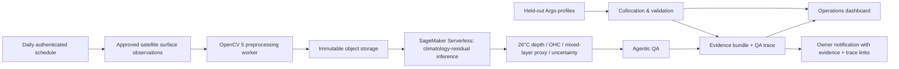

# OceanEmbed Competition Submission Pack

**OceanEmbed** is a North Indian Ocean decision-support product. It turns approved satellite surface observations and a conservative subsurface reconstruction into a traceable view of upper-ocean heat conditions. It does **not** issue cyclone forecasts or public warnings. The target use is expert review of environmental evidence, including the depth of the 26°C isotherm, ocean heat content, cloud-coverage limitations, and model uncertainty.

## Product claim and operational boundary

The product presents a physics-informed **climatology-residual** reconstruction at 15 standard depth levels from 0 to 1000 m. A monthly climatology is the prior; the model estimates bounded residuals from multi-day surface observations. When coverage or uncertainty guardrails fail, the product withholds an automated heat-fuel classification and labels the output as a selective or full climatology fallback. This is intentionally more conservative than presenting a fully reconstructed profile everywhere.

> “The satellite inputs fundamentally constrain predictive skill.” — TS-Cast, a recent uncertainty-aware reconstruction study. [1]

## Competition fit

The competition requires substantive OpenCV 5 image or video analysis and a meaningful AWS component. Its Agentic Vision path additionally requires OpenCV-derived visual evidence to influence a later plan, tool call, action, or request for human approval. [2] OceanEmbed satisfies this with a perception–decision–action loop: OpenCV creates cloud masks, inpainted surface fields, Sobel front layers, and QA regions; those signals determine whether the workflow accepts the scene, changes inpainting parameters, substitutes climatology selectively, or requests human review.

| Requirement | OceanEmbed implementation | Evidence for judges |
|---|---|---|
| OpenCV 5 | Valid-data/cloud masks, Navier–Stokes inpainting, Sobel thermal fronts, tile coverage, error/uncertainty region analysis. | Worker image performs an explicit OpenCV 5 version check; UI exposes every layer. |
| AWS | S3-compatible object storage for immutable run artifacts; SageMaker Serverless model endpoint; API/Lambda orchestration; CloudWatch-style trace events. | Architecture diagram, run manifests, endpoint configuration, event records. |
| Agentic Vision | OpenCV evidence controls a later corrective action or escalation. | Trace ledger with perception, rationale, parameter change/fallback, before/after metrics, and reviewer state. |
| Technical execution | Independent Argo collocation, depth-band statistics, baselines, failures, and reproducibility bundles. | Held-out split description plus extract/hash/artifact references. |

## Architecture



The dashboard is a TypeScript application. The preprocessing and model workloads are intentionally separate: a CPU OpenCV worker prepares a scene, while the model endpoint serves a compressed/exported inference artifact. This avoids placing the heavy scientific workload inside the dashboard runtime.

## Data and model provenance

The production manifest must identify exact product IDs, access dates, spatial subset, temporal resolution, preprocessing version, model version, and licenses. Candidate inputs include SST, sea-level anomaly/absolute dynamic topography, sea-surface salinity, and appropriate surface forcing products. GLORYS12 is a Level-4 global reanalysis at 1/12° resolution with 50 vertical levels; it assimilates satellite and in-situ profiles, so it must be treated as a training/reference product—not independent ground truth. [3]

Independent evaluation should use Argo profiles that never enter the training split. Argo is widely used to initialize subsurface forecasts and is one of the principal sources of global subsurface temperature, salinity, and velocity information. [4] The final submission should report how float profiles were quality controlled, temporally and spatially collocated, and protected from leakage through data assimilation or duplicated sources.

| Artifact class | Storage location | Database stores | Immutability practice |
|---|---|---|---|
| NetCDF/Zarr source subset | Object storage | Key, content hash, bytes, provenance | New object key per stored artifact |
| OpenCV mask/front/tile layers | Object storage | Key, source run, preprocessing parameters | Persist visual layer and parameter record together |
| Model/export artifact | Object storage/model registry | Version, hash, endpoint reference | Promote only evaluated versions |
| Argo validation extract | Object storage | Collocation ID, metrics, extract key | Preserve split and collocation recipe |
| Submission bundle | Object storage/release | Bundle hash and manifest key | Versioned release artifact |

## Inference and conservative decision logic

The model returns a temperature profile and an uncertainty estimate for each target cell. OceanEmbed derives a 26°C-isotherm depth by linear interpolation between bracketing depth levels. Ocean heat content is calculated as the vertically integrated positive temperature excess above 26°C, and the mixed-layer proxy is the first depth with a 0.5°C decrease from the surface. These are **decision-support indicators** only.

| Condition | Confidence | Automated response | User-facing label |
|---|---|---|---|
| Coverage ≥85% and median uncertainty ≤0.65°C | High | Retain reconstruction | High confidence |
| Coverage ≥70% and median uncertainty ≤1.0°C | Moderate | Retain reconstruction; expose uncertainty | Moderate confidence |
| Coverage ≥55% and median uncertainty ≤1.5°C | Limited | Selective climatology fallback for flagged tiles | Limited; review advised |
| Lower coverage or greater uncertainty | Insufficient | Full climatology fallback; request human review | Withheld automated classification |

The NOAA Satellite Ocean Heat Content Suite provides an operational precedent for tracking vertical temperature to the 26°C isotherm and lists depth of the 20°C and 26°C isotherms, mixed-layer depth, ocean heat content, and SST among its parameters. [5] OceanEmbed should show its derivations, uncertainties, and limits rather than imply equivalence to a national operational product.

## Agentic Vision QA protocol

The QA agent is not a chatbot explaining an image. It is a bounded controller whose OpenCV output selects the next action.

1. **Perceive:** produce valid-data/cloud mask, Navier–Stokes inpainting quality metrics, Sobel front-continuity score, and uncertainty/error regions.
2. **Decide:** compare evidence to fixed guardrails. Wide cloud gaps or poor front continuity select reprocessing; high uncertainty selects a selective climatology fallback; ambiguous evidence selects human review.
3. **Act:** store the changed setting or fallback mask, re-run inference where allowed, compare before/after metrics, and append a trace event.
4. **Control:** prohibit automated public warnings, preserve a reviewer state, and keep evidence and QA links in every threshold notification.

## Evaluation plan

The final evaluation should report a chronological split, for example training through 2020, validation for 2021–2022, and an entirely held-out 2023 test period. It must prevent the same Argo profile—or a directly assimilated representation of it—from appearing in both training and evaluation. Compare the reconstruction with a monthly climatology and a simple regularized baseline using the same inputs.

| Metric | Depth bands | Required reporting |
|---|---|---|
| RMSE and bias | 0–30 m, 50–200 m, 300–1000 m | Mean, sample count, confidence interval, baseline comparison |
| Correlation | All and per-depth | Explicit calculation population and missing-data rule |
| Calibration | Predicted uncertainty buckets | Error versus predicted uncertainty; coverage of intervals |
| Agent effectiveness | QA-triggered scenes | Count, action type, post-action change, human-review outcome |
| Operational latency/cost | End-to-end daily run | Source subset size, processing time, inference latency, object storage footprint |

## Demo scenario

The five-minute judge demo should start with an ocean map centered on a North Indian Ocean reference scene. Select the 100 m temperature field, switch to cloud and SST-front layers, then open the profile and heat-fuel panel. Explain that the risk badge is conditioned on evidence and confidence—not a forecast. Next, open the Argo explorer and compare the collocated profile with the matched reconstruction and baselines. Finally, open the QA ledger and show a trace where OpenCV evidence altered a later action. End with the immutable manifest, artifact hashes, and responsible-use conditions.

## Reproducible setup

The dashboard itself runs with the repository’s standard Node commands:

```bash
pnpm install
pnpm check && pnpm test
pnpm dev
```

The separate OpenCV worker is deliberately not the web-app root Docker image. Build it from the repository root with:

```bash
docker compose -f infra/docker-compose.opencv.yml build
```

The worker checks that its installed `cv2` version begins with `5.`. Before using it for scientific outputs, capture the full build digest and repeat the version check in the run manifest.

## Daily refresh and notification activation

The codebase contains an authenticated callback at `/api/scheduled/refresh-north-indian-ocean`. It is intentionally **disabled** until an approved data source and a reviewed model endpoint are configured. The callback is idempotent by daily run ID, looks up its configuration by the platform-provided task identifier, and returns structured errors. Do not use an in-process timer.

After the dashboard is published and credentials are configured, create a daily 03:30 UTC project-level schedule pointing to that callback, persist its task identifier in `pipeline_configs`, and then enable the row. The owner notification path records the evidence artifact and QA trace IDs before delivery. Each message includes the run, risk, confidence, heat-fuel/uncertainty values, an evidence link, a QA trace link, and the explicit statement that it is not a cyclone forecast.

## Responsible-use commitments

OceanEmbed must never present reconstructed outputs as direct observations. It must distinguish live data from reference material, preserve cloud/fallback masks, retain provenance, document reanalysis limitations, and require human interpretation for any operational action. It must respect all source-product licenses and should not post alerts or make public claims outside the supported evaluation range.

## References

[1] [Fablet et al., “TS-Cast: deep learning for subsurface ocean reconstruction from satellite observations in the northwestern Pacific,” *Ocean Science* (2026)](https://os.copernicus.org/articles/22/2161/2026/)

[2] [OpenCV AI Competition 2026: official overview, Agentic Vision criteria, requirements, and grant rubric](https://opencv.org/opencv-ai-competition-2026/)

[3] [Copernicus Marine Service, “Global Ocean Physics Reanalysis (GLORYS12V1)”](https://data.marine.copernicus.eu/product/GLOBAL_MULTIYEAR_PHY_001_030/description)

[4] [Argo, “Argo and the modeling community”](https://argo.ucsd.edu/science/argo-and-the-modeling-community/)

[5] [NOAA NCEI, “Satellite Ocean Heat Content Suite”](https://www.ncei.noaa.gov/products/satellite-ocean-heat-content-suite)
